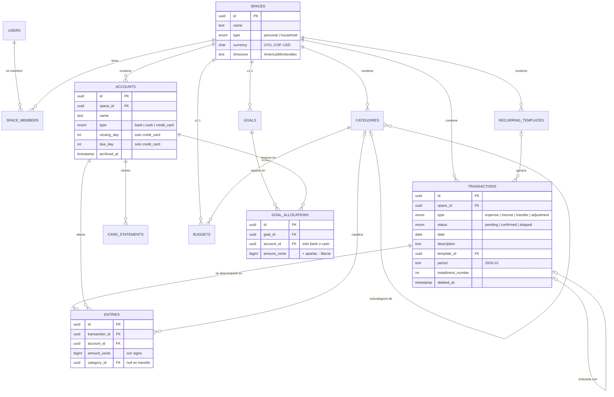

Personal Finance App · borrador v2
 
# Modelo de datos
 
Todas las tablas y cómo se relacionan. Nombres de tablas, columnas y valores en inglés (snake_case, tablas en plural); la interfaz sigue en español. La idea central: todo pertenece a un espacio, y el dinero se mueve con transacciones que se descomponen en asientos (`entries`).
 
## Diagrama
 

 
`||--o{` uno a muchos `||--|{` uno a uno o más `|o--o{` opcional El diagrama muestra solo las columnas clave; el detalle está abajo.
 
## Reglas que el modelo garantiza
 
**El saldo se calcula, no se guarda**Suma de los `entries` de una cuenta cuya transacción está `confirmed` y sin `deleted_at`.
 
**Un transfer suma cero**Sus entries no llevan categoría. Banco −3.000, Tarjeta +3.000.
 
**Expense e income siempre clasificados**Cada entry lleva categoría. Permite dividir una compra a futuro.
 
**Adjustment no es ingreso ni gasto**Saldo inicial y cuadre con el banco. No aparece en los reportes.
 
**Un pendiente por plantilla y periodo**Restricción única (`template_id`, `period`). Así el cron es idempotente.
 
**Dinero en centavos enteros**`bigint`, nunca `float`. $15,50 se guarda como 1550.
 
**Solo se aparta dinero que existe**Las metas reservan en cuentas `bank` o `cash`, nunca en una tarjeta.
 
## Tablas
 
### users
 
v1
 
La persona que inicia sesión. Plural porque `user` es palabra reservada en PostgreSQL.
 
| idPK | uuid |
| --- | --- |
| firebase_uid | único, enlaza con Firebase Auth |
| email |  |
| display_name |  |
 
### spaces
 
v1
 
Dueño de todos los datos. Cada usuario recibe "Mi espacio" al registrarse.
 
| idPK | uuid |
| --- | --- |
| name | "Mi espacio", "Hogar Rodríguez" |
| type | personal · household |
| currency | código ISO: UYU, COP, USD |
| timezone | "America/Montevideo"; el cron la usa para saber qué día es |
 
### space_members
 
v1
 
Quién tiene acceso a qué espacio. En v1, cada espacio tiene un solo miembro.
 
| user_idFK |  |
| --- | --- |
| space_idFK |  |
| role | owner · member (v2) |
 
### accounts
 
v1
 
Banco, efectivo o tarjeta. La tarjeta suma a Deuda; las demás, a Disponible.
 
| idPK | uuid |
| --- | --- |
| space_idFK |  |
| name | "Itaú", "Visa" |
| type | bank · cash · credit_card |
| closing_day | solo credit_card |
| due_day | solo credit_card |
| archived_at | null = activa; requiere saldo 0 y sin apartados |
 
### card_statements
 
v1
 
Fechas reales de cada cierre. Se calculan con los días de la cuenta y el usuario puede corregirlas si el banco las mueve.
 
| idPK | uuid |
| --- | --- |
| account_idFK |  |
| period | "2026-10" |
| closing_date |  |
| due_date |  |
 
### categories
 
v1
 
Dos niveles: principal y subcategoría. Se crean predefinidas y el usuario las edita.
 
| idPK | uuid |
| --- | --- |
| space_idFK |  |
| parent_idFK | null = categoría principal |
| name | en el idioma del usuario: "Comida" |
| kind | expense · income |
| archived_at | null = activa |
 
### recurring_templates
 
v1
 
Suscripciones, servicios y cuotas. El cron la lee cada madrugada y genera pendientes.
 
| idPK | uuid |
| --- | --- |
| space_idFK |  |
| description | "Netflix", "TV Samsung" |
| type | expense · income |
| estimated_amount_cents |  |
| account_idFK |  |
| category_idFK |  |
| day_of_month | frecuencia mensual en v1 |
| start_date |  |
| total_installments | null = indefinida |
| is_active | false al cancelar o terminar cuotas |
 
### transactions
 
v1
 
El "qué pasó". Una línea en la lista de movimientos.
 
| idPK | uuid |
| --- | --- |
| space_idFK |  |
| type | expense · income · transfer · adjustment |
| status | pending · confirmed · skipped |
| date |  |
| description |  |
| template_idFK | null si es manual |
| period | único junto con template_id |
| installment_number | "cuota 3 de 6" |
| linked_transaction_idFK | aporte al hogar (v2) |
| created_byFK | usuario; útil en hogares |
| updated_at | al editar, el backend rehace los entries |
| deleted_at | borrado suave; excluida de saldos y reportes |
 
### entries
 
v1
 
Los asientos: cómo afecta cada cuenta. Una transacción tiene uno o más.
 
| idPK | uuid |
| --- | --- |
| transaction_idFK |  |
| account_idFK |  |
| amount_cents | bigint con signo |
| category_idFK | obligatoria en expense/income; null en transfer y adjustment |
 
### budgets
 
v1.1
 
Límite mensual por categoría principal.
 
| idPK | uuid |
| --- | --- |
| space_idFK |  |
| category_idFK |  |
| monthly_limit_cents |  |
 
### goals
 
v1.1
 
"Viaje a Brasil", "PlayStation". Apartado virtual: el dinero sigue en sus cuentas.
 
| idPK | uuid |
| --- | --- |
| space_idFK |  |
| name |  |
| target_amount_cents |  |
| target_date | opcional |
| archived_at | al cumplirla o abandonarla |
 
### goal_allocations
 
v1.1
 
Cada vez que el usuario aparta o libera dinero, y en qué cuenta. No toca entries ni saldos.
 
| idPK | uuid |
| --- | --- |
| goal_idFK |  |
| account_idFK | solo bank o cash |
| amount_cents | + apartar · − liberar |
| date |  |
 
## Notas
 
- **Inglés en el código, español en la interfaz.** Los valores como `pending` o `expense` nunca se muestran tal cual: la UI los traduce. Los nombres que escribe el usuario ("Comida", "Itaú") se guardan como él los escribió.
- **La moneda vive en el espacio**: un hogar necesita su propia moneda. Cada transacción la hereda de su espacio.
- **Libre para gastar** = Disponible − suma de `goal_allocations` de metas activas. Por cuenta: saldo − lo apartado en esa cuenta.
- **Cuotas futuras comprometidas** = monto de las plantillas con cuotas restantes × cuotas que faltan. No se crean transacciones por adelantado.